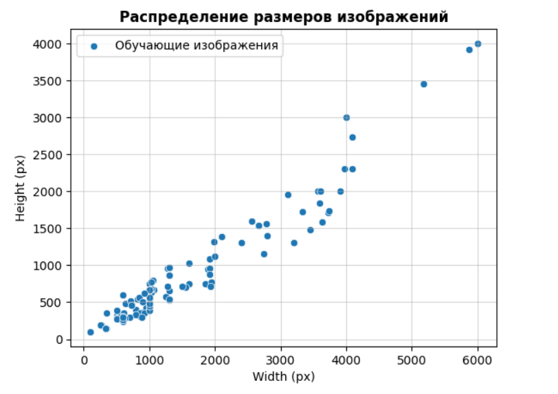
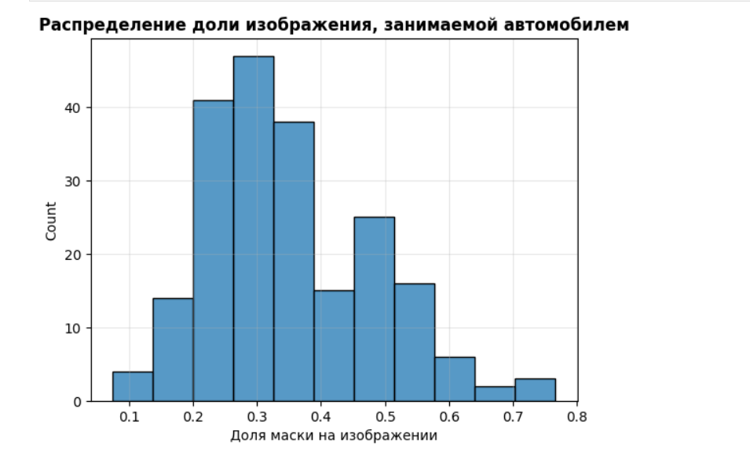

# Описание данных

Задача размытия заднего фона по сути состоит из двух этапов: 
* Отделение автомобиля на фото от заднего фона
* Применение размытия к найденному фону

## Сегментация автомобиля и фона

Чтобы обучить модель поиска автомобиля на изображении, в качестве обучающей выборки было найдены [соревнование на Kaggle](https://www.kaggle.com/datasets/intelecai/car-segmentation/code), в котором решается задача сегментация частей автомобиля.

Также был найден [сайт](https://trainingdata.pro/datasets/car-segmentation?utm_source=kaggle&utm_medium=cpc&utm_campaign=car-masks),  на котором содержится платный датасет для сегментации автомобиля, однако 20 изображений предоставлены в качестве демо бесплатно.

## Генерация обучающих данных

Было проведено исследования получения разметки с помощью огромных zero-shot моделей для задач сегментации, с целью дистилляции для более мелкой модели (подробнее на следующих слайдах).

# Анализ данных

## Размеры изображений

Изучены разрешения и соотношения сторон изображений в выборке. Это позволило убедиться, что в датасете нет изображений, которые не соответствовали бы типичным изображениям, загружаемым пользователями, что ухудшало бы качество модели на реальных данных, например, в случае маленьких изображений т.к. их качество ухудшалось бы при Reshape.

## Corner-кейсы

Визуальный осмотр данных позволил понять, что бывают случаи, когда на изображении находится сразу несколько автомобилей. В нашем случае мы хотим акцентировать внимание  лишь на основном (продаваемом) автомобиле, в этом случае для улучшения качества итоговой обученной модели в сгенерированных данных оставалась лишь самая большая маска “основного” автомобиля

## Анализ таргета

Анализ части изображения, занимаемого автомобилем позволил также проверить соответствие пользовательским сценариям.
