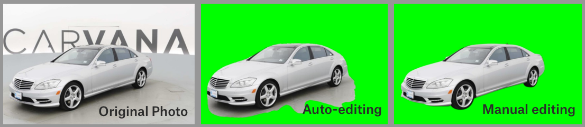
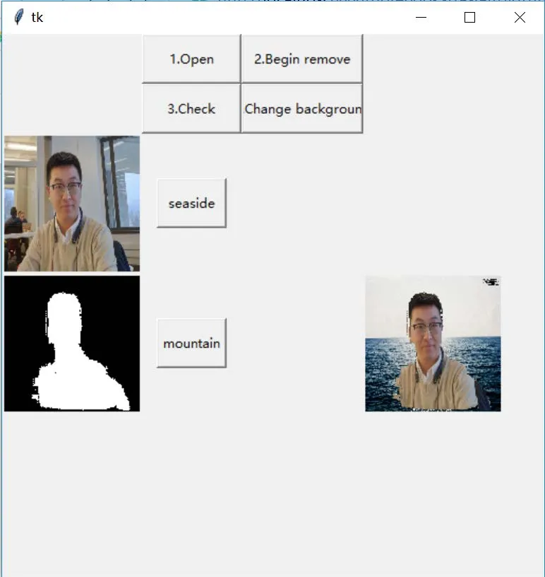

# Оценка проекта

## Потенциал проекта
Менеджеры команды Авито Авто имеют предположение, что дилеры (пользователи) продают меньше автомобилей из-за того что фото не привлекает покупателей своим фоном и сильно отличаются от остальных объявлений.

## Есть ли простое решение
* Делать блюр виньетку или иные фильтры размытия, применяемые к центру изображению

Не добавляет ценности, выглядит шаблонно, не решает задачу "продающего" фона, не используется информация о положении и наличии автомобиля на изображении 

## Реалистичность решения проблемы с помощью машинного обучения.

Один из этапов задачи представляет собой сегментацию самого автомобиля / фона (в зависимости от постановки задачи). 

У данных задач уже есть различные решения с высокими показателями метрик сементации:

1. [Детекция автомобилей, соревнование на Kaggle](https://www.kaggle.com/c/carvana-image-masking-challenge/leaderboard)

В качестве метрики качества использовался `Dice Score`, среди публичных решений можно найти те, на которых полученное значение >0.99 (максимальное значение 1), используя архитектуру UNet (свёрточная нейросеть). 

2. [В данной статье рассматривается удаление фона](https://habr.com/ru/companies/nix/articles/350576/)

3. [В данной статье рассматривается замена фона, однако объект с фотографии не согласуется с фоном](https://medium.com/@yunanwu2020/go-selfies-how-to-do-photo-background-removal-using-deep-learning-segmentation-codes-6131d59a2ca9)

4. [Universal Image Manipulation Detection using
Deep Siamese Convolutional Neural Network](https://arxiv.org/pdf/1808.06323)

5. [Image Manipulation Detection using Convolutional Neural Network](https://www.semanticscholar.org/paper/Image-Manipulation-Detection-using-Convolutional-Kim-Lee/8d2916d15ffc5b0f97a542e01780f785421185b8#paper-topics)